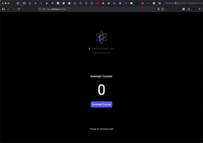
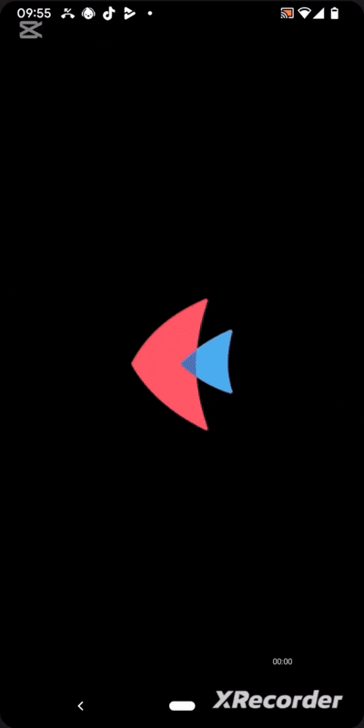
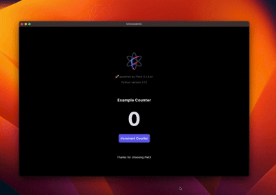

<p align="center">
    
</p>

<h1 align="center">FletX</h1>

<p align="center">
    <strong>Build production-ready Python UI apps with architecture patterns inspired by GetX</strong>
    <br/>
    <em>Reactive state • Modular routing • Clean architecture • Developer productivity</em>
</p>

<p align="center">
    <a href="https://pypi.org/project/FletXr/"></a>
    <a href="https://pepy.tech/project/FletXr"></a>
    <a href="LICENSE"></a>
    <a href="https://discord.gg/GRez7BTZVy"></a>
    <a href="https://github.com/AllDotPy/FletX"></a>
    <a href="https://github.com/AllDotPy/FletX/stargazers"></a>
</p>

<p align="center">
    <a href="#-quick-start">Quick Start</a> •
    <a href="#-features">Features</a> •
    <a href="#-showcase">Showcase</a> •
    <a href="https://alldotpy.github.io/FletX/">Docs</a> •
    <a href="https://discord.gg/GRez7BTZVy">Discord</a>
</p>

---

## 🎯 Transform Your Python UI Development

FletX is an architectural framework that brings **production-grade patterns** to [Flet](https://flet.dev) applications. Built on proven GetX principles, it combines reactive state management, modular routing, and dependency injection—all with zero boilerplate.

---

## ✨ Why Developers Choose FletX

| Problem | Solution |
|---------|----------|
| **Spaghetti code** | Pages → Controllers → Services architecture |
| **Manual state management** | Reactive primitives (`RxInt`, `RxList`, `Computed`) |
| **Boilerplate routing** | Declarative routing with type safety |
| **Dependency chaos** | Global DI container with tag-based lookup |
| **Slow development** | CLI for instant scaffolding & generation |
| **Poor dev experience** | Hot reload, testing utilities, lifecycle hooks |

---

## 🎬 Showcase

See FletX in action across different platforms:

<table>
    <tr>
        <td width="400">
            <strong>Web</strong><br/>
            
        </td>
        <td rowspan="2". width="350">
            <strong>Mobile</strong><br/>
            
        </td>
    </tr>
    <tr>
        <td width="400">
        <strong>Desktop</strong><br/>
        
        </td>
    </tr>
</table>

---

## 🚀 Why FletX? (The Real Story)

| Feature | Impact |
|---------|--------|
| **Reactive state** | Auto UI updates—no manual `page.update()` (`setState`) |
| **Modular routing** | Deep linking, guards, middlewares, dynamic parameters |
| **Dependency injection** | Services & controllers managed elegantly |
| **Clean architecture** | Scale from MVP to enterprise apps |
| **Developer CLI** | 10x faster project setup & component generation |
| **Type hints** | Full IDE support and runtime safety |

---

## ⚡ Quick Start

Get a production-ready app running in **under 3 minutes**:

```bash
# 1. Install (Python 3.10+)
pip install FletXr[dev] --pre

# 2. Create new project
fletx new my_project
cd my_project

# 3. Run with hot reload
fletx run --web --watch
```

**That's it!** Your app is now running in the browser with live reload. Every save triggers instant feedback.

---

## 📋 Project Structure (Auto-Generated)

```
my_project/
├── app/
│   ├── controllers/        # State & business logic
│   ├── services/           # APIs, storage, utilities
│   ├── pages/              # UI screens
│   ├── components/         # Reusable widgets
│   └── routes.py           # All routes in one place
├── assets/                 # Images, fonts, etc.
├── tests/                  # Automated tests
├── pyproject.toml          # Dependencies & config
└── main.py                 # Entry point
```

Every file generated by `fletx generate` follows FletX conventions—no guessing, no inconsistency.

---

## 💡 Live Example: Counter App

```python
import flet as ft
from fletx.app import FletXApp
from fletx.core import FletXPage, FletXController, RxInt
from fletx.navigation import router_config
from fletx.decorators import obx


class CounterController(FletXController):
    def __init__(self):
        self.count = RxInt(0)  # Reactive state
        super().__init__()

    def increment(self):
        self.count.increment()  # UI auto-updates


class CounterPage(FletXPage):
    ctrl = CounterController()

    @obx  # 🪄 Magic: auto-tracks reads, rebuilds on change
    def counter_display(self):
        return ft.Text(
            f"Count: {self.ctrl.count}",
            size=50, weight="bold",
            color = 'red' if not self.ctrl.count.value % 2 == 0 else 'white'
        )

    def build(self):
        return ft.Column(controls=[
            self.counter_display(),
            ft.ElevatedButton(
                "+1",
                on_click=lambda _: self.ctrl.increment()
            ),
        ])


if __name__ == "__main__":
    # Defining route
    router_config.add_route(
        path = '/', 
        component = CounterPage
    )

    app = FletXApp(title="Counter", initial_route="/", debug=True)
    app.run()
```

**No boilerplate. No manual rebuilds. Just reactive state.**

---

## 🧠 Core Architecture

Build scalable apps with separation of concerns:

### Controllers — Reactive State & Logic
```python
class UserController(FletXController):
    def __init__(self):
        self.users = RxList([])
        self.selected = RxInt(-1)
        super().__init__()

    def fetch_users(self):
        # Async-friendly, auto-notifies UI
        users = api.get_users()
        self.users.set(users)

    def select(self, index):
        self.selected.set(index)
```

### Pages — UI Composition
```python
class UserPage(FletXPage):
    ctrl = UserController()

    @obx
    def user_list(self):
        return ft.Column(controls=[
            ft.Text(user.name) for user in self.ctrl.users
        ])

    def build(self):
        return self.user_list()
```

### Services — Reusable Utilities
```python
class ApiService(FletXService):
    def get_users(self):
        # HTTP calls, caching, error handling
        pass
```

### Routing — Type-Safe Navigation
```python
from fletx.navigation import router_config, navigate

router_config.add_route("/users/:id", UserDetailPage)
navigate("/users/123")  # Fully type-checked
```

### Decorators — Execution Control
```python
from fletx.decorators import reactive_debounce, reactive_memo

@reactive_debounce(0.5)  # Debounce at 500ms
def search(query):
    pass

@reactive_memo(maxsize=100)  # Memoize results
def expensive_compute(n):
    pass
```

---

## 📊 Real-World Impact

FletX users report:

- **50% faster development** — Scaffold → code → deploy in hours, not days
- **0 boilerplate** — Pre-built patterns for common patterns
- **10k+ downloads** — Trusted by developers building production apps
- **Active community** — Daily updates, responsive maintainers, helpful Discord

---

## 🎓 What You Get

✅ **Full-featured CLI** — `fletx new`, `fletx generate`, `fletx run`, `fletx test`  
✅ **Reactive primitives** — `RxInt`, `RxStr`, `RxList`, `RxDict`, `Computed`  
✅ **Smart decorators** — `@obx`, `@reactive_debounce`, `@reactive_memo`, and 10+ more  
✅ **Built-in DI** — Global service container with tag-based lookup  
✅ **Testing support** — Built-in utilities for unit & integration tests  
✅ **TypeScript-grade IDE support** — Full autocomplete and type hints  
✅ **Active maintenance** — Bug fixes, features, and community updates  

---

## 🚢 CLI Commands at a Glance

```bash
# Create & manage projects
fletx new my_project --author "You"
fletx generate controller Home --with-test
fletx generate service Api
fletx generate page Settings

# Development & testing
fletx run --web --watch                    # Browser + hot reload
fletx run --desktop                        # Desktop window
fletx run --android                        # Android device
fletx test --coverage                      # Test with coverage

# Validation
fletx check --json                         # Verify compatibility
```

---

## 📚 Documentation & Resources

| Resource | Link |
|----------|------|
| **Full Docs** | [📖 Getting Started Guide](https://alldotpy.github.io/FletX/) |
| **Examples** | [🎯 Real Projects](https://github.com/AllDotPy/Awsome-FletX-Example-Apps) |
| **Community** | [💬 Discord Chat](https://discord.gg/GRez7BTZVy) |
| **Video Tutorials** | [🎥 YouTube Course](https://www.youtube.com/watch?v=BSp7TUu3Dvo) |
| **Issue Tracker** | [🐛 GitHub Issues](https://github.com/AllDotPy/FletX/issues) |

---

## 🤝 Join the Community

We're building FletX together. Here's how you can help:

- ⭐ **Star us on GitHub** — Every star helps new developers find us
- 🐛 **Report issues** — Found a bug? Open an issue (we fix them fast)
- 💡 **Suggest features** — Have an idea? Discussions are open
- 📝 **Write docs** — Help improve guides and examples
- 🔧 **Contribute code** — PRs welcome, see [CONTRIBUTING.md](CONTRIBUTING.md)
- 💬 **Join Discord** — Chat with maintainers and other developers

---

## 📈 Metrics That Matter

[](https://github.com/AllDotPy/FletX)
[](https://pepy.tech/project/FletXr)
[](https://discord.gg/GRez7BTZVy)

---

## 🎯 Next Steps

**Ready to build?**

1. [Install FletX](https://alldotpy.github.io/FletX/getting-started/installation/) (2 min)
2. [Create your first project](https://alldotpy.github.io/FletX/getting-started/fletx-cli/) (3 min)
3. [Learn the patterns](https://alldotpy.github.io/FletX/getting-started/architecture/) (15 min)
4. [Build something awesome](https://github.com/AllDotPy/Awsome-FletX-Example-Apps) (∞ min)

---

## 📄 License & Attribution

MIT © 2026 AllDotPy

<br/>

<p align="center">
  <strong>Built with ❤️ by <a href="https://alldotpy.com">AllDotPy</a></strong>
</p>

<p align="center">
  <a href="https://github.com/AllDotPy/FletX/stargazers">⭐ Star us on GitHub</a> •
  <a href="https://discord.gg/GRez7BTZVy">💬 Join Discord</a> •
  <a href="https://alldotpy.github.io/FletX/">📖 Read Docs</a>
</p>
