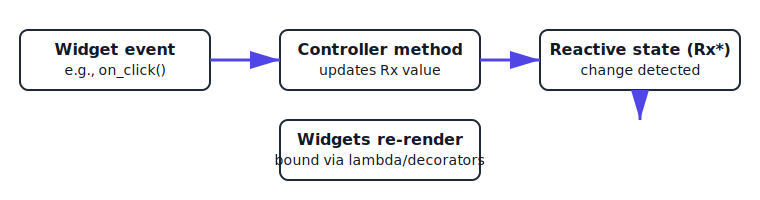
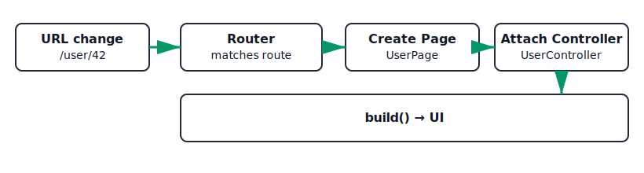
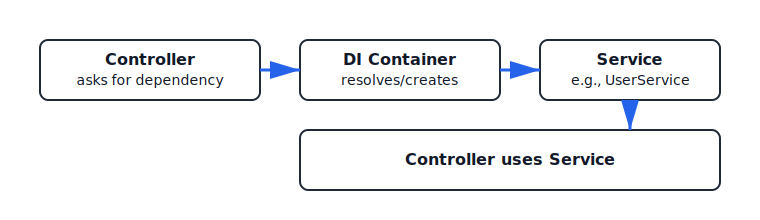

# 🏗️ FletX Architecture (Progressive Guide)

FletX is a **modular, reactive application layer** for [Flet](https://flet.dev). Think of it as the scaffolding that helps your UI, logic, and navigation work together cleanly.

This guide builds up from the big picture to the details, with diagrams and tiny examples you can copy and adapt.

---

## 🗺️ Big Picture

Analogy: FletX is like a theater production.

- The **Page** is the stage where the scene is rendered.
- The **Controller** is the director that decides what happens next.
- **Reactive state (Rx)** is the script prompts: when a line changes, actors (widgets) immediately react.
- **Services** are backstage crews (API, storage, utilities).
- The **Router** is the stage manager who swaps scenes.

High-level flow:

```text
User action → Controller updates reactive state → Widgets re-render
```

<figure>
  
  <figcaption><strong>Reactivity flow</strong>: events update reactive state; bound widgets re-render automatically.</figcaption>
</figure>

Navigation flow:

```text
Route change → Page created → Controller available → build() renders UI
```

<figure>
  
  <figcaption><strong>Routing flow</strong>: router matches URL, creates the page, attaches its controller, then renders.</figcaption>
</figure>

!!! tip "How to read these diagrams"

    - Boxes represent **components** (Page, Controller, Service, etc.).
    - Arrows indicate **direction of flow** (events → state → UI).
    - Bold labels are the **key step** in each stage.
    - White diagram backgrounds ensure legibility in **dark mode**; use the ASCII diagrams alongside if you prefer text.

---

## 🧱 Core Pieces (at a glance)

- Page (`FletXPage`): builds UI in `build()` and accesses its controller via `self.ctrl` (or any variable name you choose).
- Controller (`FletXController`): holds logic and reactive state (e.g., `RxInt`, `RxStr`).
- Services (optional): reusable dependencies resolved via DI (dependency injection).
- Router (`router_config`): maps paths to pages; supports dynamic params and guards.

Simple data flow:

```text
[Widget event] ──▶ [Controller method] ──▶ [Rx value changes] ──▶ [UI auto-updates]
```

---

## ✋ First Contact: 30‑second example

```python
import flet as ft
from fletx.core import FletXPage, FletXController, RxInt
from fletx.decorators import obx

class CounterController(FletXController):
    def __init__(self):
        self.count = RxInt(0)
        super().__init__()

class CounterPage(FletXPage):
    ctrl = CounterController()  # 'ctrl' is a convention; you can name it anything

    @obx
    def counter_text(self):
        return ft.Text(f"Count: {self.ctrl.count.value}", size=40)

    def build(self):
        return ft.Column([
            self.counter_text(),
            ft.ElevatedButton("+1", on_click=lambda e: self.ctrl.count.increment())
        ])
```

What to notice:

- The `@obx` decorator makes the method reactive — it re-renders when `count` changes.
- The button calls a controller method that mutates reactive state.
- `ctrl` is just a variable name; you can use any name you prefer.

---

## 🔄 Reactivity (how updates propagate)

```text
       increment()
           │
           ▼
  [RxInt.count]  ── change detected ──▶  widgets depending on it re-render
```

Key ideas:

- Use `Rx*` types (`RxInt`, `RxStr`, `RxList`, `RxDict`, …) for observable state.
- Use `@obx` decorator or reactive decorators so widgets update automatically.
- Keep computations inside the controller; keep the page mostly declarative.

Tiny example:

```python
from fletx.core import FletXController, RxStr

class HelloController(FletXController):
    def __init__(self):
        self.name = RxStr("World")
        super().__init__()

    def set_name(self, value: str):
        self.name.value = value.strip() or "World"
```

```python
import flet as ft
from fletx.core import FletXPage
from fletx.decorators import obx

class HelloPage(FletXPage):
    ctrl = HelloController()

    @obx
    def greeting(self):
        return ft.Text(f"Hello, {self.ctrl.name.value}!")

    def build(self):
        return ft.Column([
            self.greeting(),
            ft.TextField(on_change=lambda e: self.ctrl.set_name(e.control.value))
        ])
```

---

## 🧭 Routing (moving between pages)

Basic setup:

```python
from fletx.app import FletXApp
from fletx.navigation import router_config

router_config.add_routes([
    {"path": "/", "component": HomePage},
    {"path": "/user/:id", "component": UserPage},
])

app = FletXApp(title="My App", initial_route="/")
app.run()
```

Access dynamic params inside a page:

```python
class UserPage(FletXPage):
    ctrl = UserController()

    def build(self):
        user_id = self.route_info.params["id"]
        # render with user_id
```

Diagram:

```text
URL change → match route → create Page → attach Controller → build() → UI
```

Learn more: see `Getting Started → Routing System` and `Pages (views)`.

---

## 🧩 Dependency Injection (Services and reuse)

Analogy: DI is a tool bench. Controllers don’t build the tools; they pick them up.

```python
class UserService:
    def fetch_user(self, user_id: str) -> dict:
        return {"id": user_id, "name": "Jane"}

# Register the service with DI container (typically in main.py or app setup)
from fletx.core import FletX
FletX.put(UserService)  # Register as singleton

class UserController(FletXController):
    def __init__(self):
        self.user_service = FletX.find(UserService)
        self.user = RxDict({})
        super().__init__()

    def load_user(self, user_id: str):
        self.user.value = self.user_service.fetch_user(user_id)
```

DI flow:

```text
[Controller] ──asks──▶ [DI container] ──returns──▶ [Service instance]
```

<figure>
  
  <figcaption><strong>Dependency Injection</strong>: controllers ask the container for services instead of constructing them.</figcaption>
</figure>

Learn more: see `Getting Started → Dependency Injection` and `Services`.

---

## 👣 End‑to‑End Mini Walkthrough

Goal: Tap a button on `CounterPage` to increment a number.

1) Router maps `/` → `CounterPage`.
2) `CounterPage` is created with `ctrl = CounterController()`.
3) UI shows a `Text(lambda: ...)` bound to `ctrl.count`.
4) Button calls `ctrl.count.increment()`.
5) `RxInt` notifies dependents → `Text` re-renders with the new value.

---

## 🧰 Common Patterns

- Keep pages thin; put logic in controllers.
- Use services for I/O and reuse (API, storage, computation helpers).
- Prefer small, focused controllers per page/feature.
- Derive view state from a few reactive primitives to avoid duplication.
- Use route params to load data in `on_init`/first build.

---

## ✅ Best Practices

- Name reactive variables by intent (e.g., `isLoading`, `selectedUserId`).
- Avoid mutating raw data in pages; call controller methods instead.
- Keep `build()` pure; it should read state and declare UI, not perform side-effects.
- Debounce or throttle controller methods that respond to rapid UI events.
- Centralize navigation in controller methods for testability.
- Guard your routes when needed (auth, permissions).

---

## 🧪 Minimal App Template

```python
# main.py
from fletx.app import FletXApp
from fletx.navigation import router_config

router_config.add_route("/", CounterPage)

app = FletXApp(title="Demo App")
app.run()
```

```python
# pages/counter.py
import flet as ft
from fletx.core import FletXPage, FletXController, RxInt
from fletx.decorators import obx

class CounterController(FletXController):
    def __init__(self):
        self.count = RxInt(0)
        super().__init__()

class CounterPage(FletXPage):
    ctrl = CounterController()

    @obx
    def count_display(self):
        return ft.Text(f"{self.ctrl.count.value}", size=40)

    def build(self):
        return ft.Column([
            self.count_display(),
            ft.ElevatedButton("Increment", on_click=lambda e: self.ctrl.count.increment()),
        ])
```

---

## 🔗 Where to go next

- Getting Started → `Pages (views)`
- Getting Started → `Controllers`
- Getting Started → `Routing System`
- Getting Started → `State Management`
- Getting Started → `Dependency Injection`
- Sample project: `Getting Started → Sample Project`
- Real-world example: [Fake Shop E-commerce App](https://github.com/AllDotPy/fake-shop)

---

## 📚 Reference Cheatsheet

| Component         | Responsibility                           |
| ----------------- | ---------------------------------------- |
| `FletXPage`       | Builds the UI, binds to controller       |
| `FletXController` | Holds business logic and reactive state  |
| `Rx*` objects     | Reactive state (trigger UI rebuilds)     |
| `router_config`   | Defines app navigation routes            |
| Services          | Shared utilities for APIs, storage, etc. |